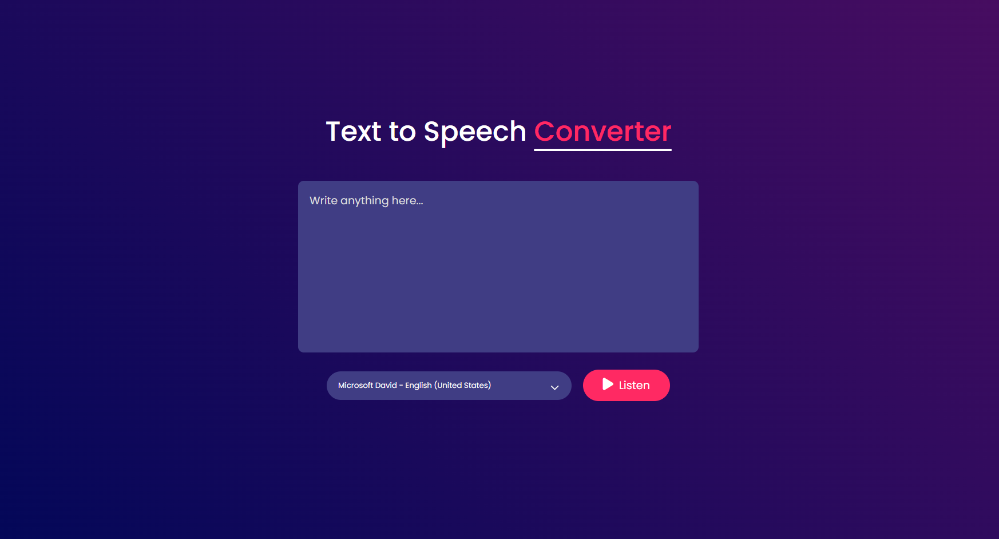

# Text to Speech Converter




The **Text to Speech Converter** is a simple web application that allows users to convert written text into spoken words. Built using HTML, CSS, and JavaScript, this app provides an intuitive interface where users can input text and generate speech in different voices. It also includes a feature to change the voice, giving users the flexibility to choose from a variety of voice options.

## Features

- **Text to Speech Conversion**: Users can input text, and the app will convert it into speech.
- **Voice Selection**: Users can choose from a range of different voices to hear the text spoken in various tones.
- **User-Friendly Interface**: A simple and clean interface makes it easy for users to interact with the app.
- **Cross-Browser Compatibility**: The app is designed to work seamlessly across all modern browsers.

## How It Works

1. **Input Text**: Users enter the text they want to convert to speech in the provided text box.
2. **Select Voice**: Users can select their preferred voice from the dropdown menu.
3. **Generate Speech**: Upon clicking the "Speak" button, the app will generate the speech in the selected voice.

## Technologies Used

- **HTML**: For the structure of the web page.
- **CSS**: For styling the user interface.
- **JavaScript**: For handling the text to speech conversion and voice selection functionality.

## Getting Started

1. Clone the repository:
   ```bash
   git clone https://github.com/Shaw145/Text-To-Voice-Converter.git

## Credits

- [**GreatStack**](https://www.youtube.com/@GreatStackDev)

